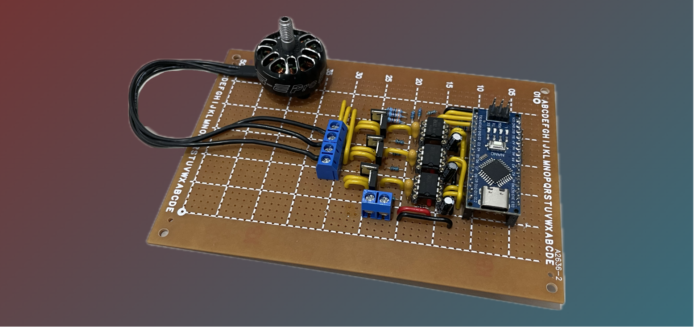

![Forks][forks-shield][forks-url]
![Stargazers][stars-shield][stars-url]
![Issues][issues-shield][issues-url]
![Unlicense License][license-shield][license-url]

 

  
  <h3 align="center">Simple Brushless Motor Electronic Speed Controller</h3>

  

    A simple BLDC ESC with RC PWM control build on perfboard.
  

## About The Project

This project started with my naivety and ignorance. In an effort to avoid buying an ESC for my RC plane, I went down a rabbit hole learning how to build one and ultimately discovered why just buying one would have saved me a lot of time (lol).

While trying to understand how a BLDC ESC works, I found many existing projects either too confusing or too advanced for my skill level. That’s why I decided to build my own barebones ESC as a clear, beginner-friendly learning project to figure out how this stuff actually works.

### Bill of Materials

Most of this stuff I bought from Aliexpress (cause im broke)

* Arduino Nano 3.0
* 3x IR2104
* 6x IRLU7843
* 3x 2.2uF Tantalum capacitor
* 3x 10uF Electrolytic Capacitor
* 3x 1N4148 Diode
* 6x 33k Resistor
* 3x 10k Resistor
* 6x 100R Resistor
* 22 AWG Solidcore Wire
* Perfboard
* Headers
* Screw Terminals

### Tools I used

* Multimeter (Ferrex, ALDI)
* Soldering Iron (FNIRSI HS-02)
* Oscilloscope (Rigol DHO804)
* Power Supply (Korad KA3005DS)

## License

Distributed under the Unlicense License. See `LICENSE.txt` for more information.

## Contact

Red - Redstbox@proton.me

## Acknowledgments

As a total beginner this project would not be possible without these resources (and people!)

* [Port Manipulation](https://docs.arduino.cc/retired/hacking/software/PortManipulation/)
* [Malven's Flexbox Cheatsheet](https://docs.arduino.cc/language-reference/en/functions/math/map/)
* [Foolish Engineer Bootstrap Gate driving circuit](https://www.youtube.com/watch?v=em5BuCFSuBw&t)
* [Simple Circuits ESC](https://simple-circuit.com/arduino-brushless-dc-motor-controller/)
* [HyperSpace Pirates ESC](https://www.youtube.com/watch?v=F8l9Z1HGYcU)
* [ReadMe Layout](https://github.com/othneildrew/Best-README-Template/tree/main)

